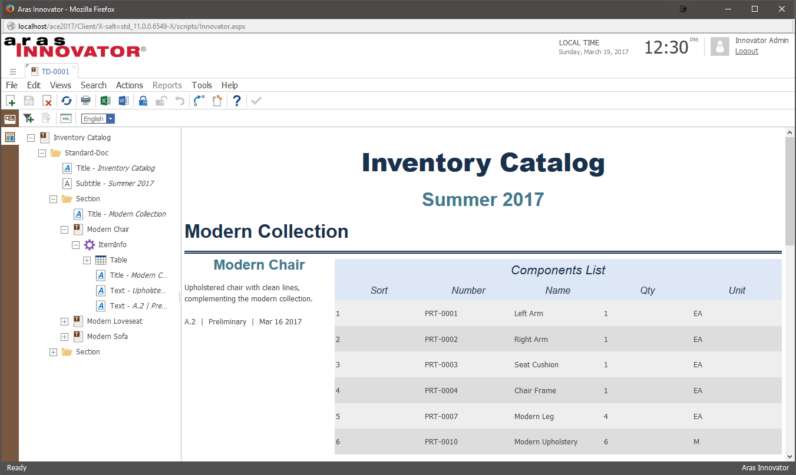

# CustomTechDocs

Demonstrates how to create a custom content generator for Tech Doc schema elements.

## How It Works

The project's import package adds a new content generator method for the ItemInfo schema element, replacing the out-of-the-box implementation. The new content generator method, `labs_ItemInfoContentGenerator`, populates every new ItemInfo element with the name, description, cost, major revision/generation, state, and created date for the selected assembly (Part item). The method also adds the assembly's BOM in a tabular layout.

## History

This project and the following release notes have been migrated from the old Aras Projects page.

Release | Notes
--------|--------
[v1.1](https://github.com/ArasLabs/custom-tech-docs/releases/tag/v1.1) | Fixes an import error.
[v1.0](https://github.com/ArasLabs/custom-tech-docs/releases/tag/v1.0) | First release. Though built and tested using Aras 11.0 SP9, this project may function in older releases of Aras 11.0.

#### Supported Aras Versions

Project | Aras
--------|------
[v1.1](https://github.com/ArasLabs/custom-tech-docs/releases/tag/v1.1) | 11.0 SP9
[v1.0](https://github.com/ArasLabs/custom-tech-docs/releases/tag/v1.0) | 11.0 SP9

## Installation

#### Important!
**Always back up your code tree and database before applying an import package or code tree patch!**

### Pre-requisites

1. Aras Innovator installed (version 11.0 SPx preferred)
2. Aras Technical Documentation is installed
3. Aras Package Import tool
4. CustomTechDocs import package

### Install Steps

1. Backup your database and store the BAK file in a safe place.
2. Open up the Aras Package Import tool.
3. Enter your login credentials and click **Login**
  * _Note: You must login as root for the package import to succeed!_
4. Enter the package name in the TargetRelease field.
  * Optional: Enter a description in the Description field.
5. Enter the path to your local `..\CustomTechDocs\Import\imports.mf` file in the Manifest File field.
6. Select the following in the Available for Import field.
  * **aras.labs.CustomTechDocs**
  * **com.aras.innovator.solution.TechDoc**
  * **com.aras.innovator.tdf**
  * **com.aras.innovator.solution.PLM**
7. Select Type = **Merge** and Mode = **Thorough Mode**.
8. Click **Import** in the top left corner.
9. Close the Aras Package Import tool.

You are now ready to login to Aras and try out the CustomTechDocs project.

## Usage

**Pre-requisite:** The Aras instance should include some Parts with BOM relationships.

1. Log in to Aras as admin.
2. Navigate to **Technical Documentation > Technical Documents**.
3. Create a new Technical Document with the `Standard` schema.
4. Add an ItemInfo element to the document, selecting a Part with Part BOM relationships when the search dialog appears.
5. Save the document.

## Contributing

1. Fork it!
2. Create your feature branch: `git checkout -b my-new-feature`
3. Commit your changes: `git commit -am 'Add some feature'`
4. Push to the branch: `git push origin my-new-feature`
5. Submit a pull request

For more information on contributing to this project, another Aras Labs project, or any Aras Community project, shoot us an email at araslabs@aras.com.

## Credits

Created by Eli Donahue for Aras Labs. @EliJDonahue

## License

Aras Labs projects are published to Github under the MIT license. See the [LICENSE file](./LICENSE.md) for license rights and limitations.
